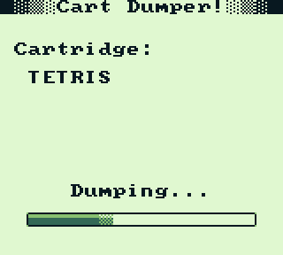

# Gameboy Cartridge Dumper

This is a rom that loads its main loop into ram on the Gameboy, lets you swap cartridges and then will dump the contents of that cartridge via a link cable to [a Raspberry Pi listening](https://github.com/Palmr/cart-dumper-listener) for the ROM data.

Currently tested using an EMS 64M flashcart and both a Gameboy pocket and Gameboy Color.

## Screenshots

## TODO

- [x] Build a ROM showing text on the screen using RGBDS
  - [x] Test it works on real hardware
- [x] Copy code to RAM and test running from there works in an emulator
  - [x] Test it works on real hardware
  - [x] Add function to fix JUMP and CALL commands once code is moved to RAM
- [x] Read and display [the title](http://gbdev.gg8.se/wiki/articles/The_Cartridge_Header#0134-0143_-_Title) from the cartridge header
- [x] Test swapping cartridges works on real hardware
- [x] Test for the Nintendo logo like the boot ROM does to see if a valid cart is plugged in
- [x] Read joypad data
  - [x] Read only what's needed when I need it
- [x] Test serial connection works
- [ ] Dump cartridge data over seial port when Start pressed
  - [x] Support basic 32K cartridge
  - [ ] Support ROM banking
    - [x] MBC1
    - [ ] MBC2
    - [ ] MBC3
    - [ ] MBC5
  - [ ] Support SRAM reading
  - [ ] Add support for checking the data was properly recieved
  - [x] Screen display dump progress
    - Add stat check in TX loop, only display if clear. No need to loop-block
  - [ ] Option to dump using external clock
    - Would need a re-work of the post-TX delay timer code
- [ ] Add other dumping methods
  - View hex on screen
  - QR Code (wildcard)
- [ ] Add more of a menu instead of debug tiles
  - [ ] Show more cart info
  - [x] Nice dump process bar
  - [ ] Menu for dump methods
  - [ ] Menu for what to dump (rom/save)
  - [ ] Option to boot the cart that's plugged in
    - [x] Works on DMG
    - [ ] Works on CGB (need to make cart CGB compatible)

## To Build

Get [RGBDS (Rednex Game Boy Development System)](https://github.com/bentley/rgbds) and change the paths in ./compile.bat to point to the RGBDS executables. The compile batch file assembles, links and fixes creating a cart-dumper.gb file to use.

## To Use

Copy the cart-dumper.gb rom to a flash-cart, run it on a Gameboy, carefully remove the flashcart once it's running, carefully (slowly, sometimes going too fast will reboot the Gameboy) put a new cartridge in and then wait for the cartridge title to be shown on screen.

Once connected to [a running listener](https://github.com/Palmr/cart-dumper-listener) via the link cable you can press Start on the Gameboy and it will send the cartridge data to the listener.
